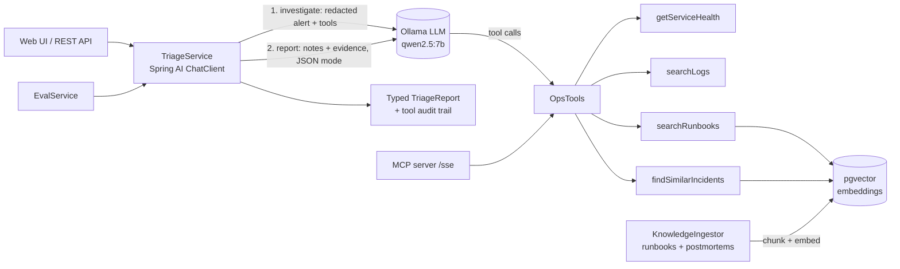

# IncidentPilot

**An AI agent that triages production incidents for a file-transfer platform.** It reads the alert, checks service health, searches the logs, looks up runbooks and past postmortems (RAG), and returns a structured root-cause report with evidence, next steps and an audit trail of every step it took.

Built in **Java 21 + Spring Boot 3 + Spring AI**, with **pgvector** for retrieval, **Ollama** for a fully local LLM (no data leaves the machine), an **MCP server** that exposes the same tools to any AI client, a **PII/secret redaction guardrail**, and an **evaluation harness** that scores the agent against labelled incidents.

> All platform data, logs, runbooks and incidents in this repo are synthetic.

---

## Why this exists

On-call engineers spend the first 30-60 minutes of an incident doing the same thing: check dashboards, grep logs across services, find the runbook, remember whether it happened before. IncidentPilot does that first pass automatically and shows its work, so the human starts from a cited hypothesis instead of a blank screen.

## Architecture



| Piece | What it does | File |
|---|---|---|
| Agent | Two steps: investigate with tools, then write a typed JSON report from the evidence | `triage/TriageService.java` |
| Tools | Health, log search, runbook search, similar incidents. Each call is traced. | `ops/OpsTools.java` |
| RAG ingestion | Splits markdown runbooks/postmortems into chunks, embeds, stores in pgvector | `knowledge/KnowledgeIngestor.java` |
| RAG retrieval | Similarity search with metadata filter (runbook vs incident) | `knowledge/KnowledgeBase.java` |
| Guardrail | Masks emails, passwords, tokens, AWS keys, SSNs, card numbers before the LLM sees text | `guard/Redactor.java` |
| Evals | Replays every incident snapshot and scores category accuracy, right-runbook citation and latency | `eval/EvalService.java` |
| MCP | Publishes the same tools over Model Context Protocol | `config/AppConfig.java` |
| Data | 6 incident snapshots, 6 runbooks, 5 postmortems | `src/main/resources/` |

## Run it

### Mac (Apple Silicon) - recommended

Install **Docker Desktop** and the **Ollama** app (ollama.com), open both, then in Terminal:

```bash
git clone https://github.com/Mahipvk/incident-pilot && cd incident-pilot
docker compose -f docker-compose.mac.yml up --build
```

Ollama runs natively so the model uses the Mac GPU. First start downloads the models (~5 GB). When the log says `Started IncidentPilotApplication`, open **http://localhost:8080**.

### Windows (PowerShell)

Needs **Docker Desktop** and ~16 GB RAM (8 GB works with the smaller model below). Nothing else: Java and Maven run inside Docker.

```powershell
git clone https://github.com/Mahipvk/incident-pilot; cd incident-pilot
docker compose up --build
```

First start downloads the models (~5 GB), so allow 10-20 minutes. When the log says `Started IncidentPilotApplication`, open **http://localhost:8080**.

Low on RAM? Use a smaller model:

```powershell
$env:CHAT_MODEL="qwen2.5:3b"; docker compose up --build
```

## Use it

- **UI:** pick an incident, click *Triage this incident*. Click *Run evals* to score all six.
- **API:**
  ```powershell
  irm localhost:8080/api/triage -Method Post -ContentType application/json -Body '{"snapshotId":"disk-full"}'
  irm localhost:8080/api/evals -Method Post
  ```
- **MCP:** any MCP client can connect to `http://localhost:8080/sse` and call the four ops tools directly. Easiest test: `npx @modelcontextprotocol/inspector`, then connect to that URL.

## Evaluation results

Six labelled incident snapshots, model `qwen2.5:7b` running locally on a MacBook Air M4 (16 GB).

| Version | Change | Correct category | Cited the right runbook | Avg time / incident |
|---|---|---|---|---|
| v1 | Investigate + report in two model calls | 5/6 (83%) | not measured | 117.6 s |
| v2 | Similarity scores on retrieved incidents; "logs outrank history" | 5/6 (83%) | not measured | 108.6 s |
| v3 | Clearer category definitions; stricter metric | **6/6 (100%)** | **6/6 (100%)** | 113.2 s |

"Cited the right runbook" checks that the report cites the runbook that actually matches the incident, not just any source. v1 and v2 only checked that *some* source was cited (100% both times), which turned out to be too easy a bar.

**Caveats, stated plainly:** six cases is a small test set, and the v3 definitions were written after looking at the failure, so 6/6 may partly reflect tuning to this set. Each result is a single run of a non-deterministic model. The next step is more and harder test incidents.

## What I learned building it

1. **Small models do one job at a time.** The first version asked the model to call tools *and* return strict JSON in one call; it returned empty output. Splitting it into *investigate* (tools, free text) and *report* (no tools, JSON mode, raw evidence passed forward) fixed it.
2. **Make tools forgiving.** The model often guesses the wrong log keyword. The log tool now falls back to the service's ERROR/WARN lines and records that in the audit trail.
3. **Read the audit trail before "fixing" anything.** The one failing case (`queue-backlog`) looked like a retrieval problem. The audit trail showed the agent's diagnosis was right (SMTP relay down, so the notification consumer crashed); the real issue was my category labels mixing symptoms with causes.
4. **Measure the right thing.** "Cited a source" was 100% even when the cited runbooks were irrelevant. "Cited the right runbook" is the honest metric.

## Design decisions (good interview material)

- **Local model by default.** Incident data in banks and other regulated firms usually can't go to a public API. Ollama keeps everything on the machine. Spring AI makes swapping in Claude, OpenAI or AWS Bedrock a dependency + config change.
- **Snapshots instead of live systems.** Each incident is a frozen set of health, logs and alert. This makes the agent testable and the evals repeatable.
- **Typed output.** The model must return JSON matching `TriageReport`. If it doesn't, the service falls back safely instead of crashing.
- **Audit trail.** Every tool call is recorded and shown, so an engineer can check *why* the agent concluded something.
- **Redaction at the boundary.** Both the alert and every log line returned by a tool go through the redactor before reaching the model.
- **One snapshot has no matching postmortem** (`queue-backlog`), to test that the agent reasons from logs and runbooks instead of copying a past incident.

## Roadmap

- [ ] Add a Claude / Bedrock profile and compare eval scores against the local model
- [ ] Ingest alerts from Kafka instead of the UI
- [ ] OpenTelemetry tracing of every LLM and tool call
- [ ] Angular front end
- [ ] Deploy to AWS (ECS or EKS) with Terraform/CloudFormation
- [ ] Add a "hallucination check" eval: every quoted evidence line must exist in the snapshot logs
- [ ] Let `searchLogs` accept several services / keywords in one call (the model often tries `upload-service, edge-gateway`)
- [ ] Grow the eval set beyond 6 incidents and run each several times to measure consistency
